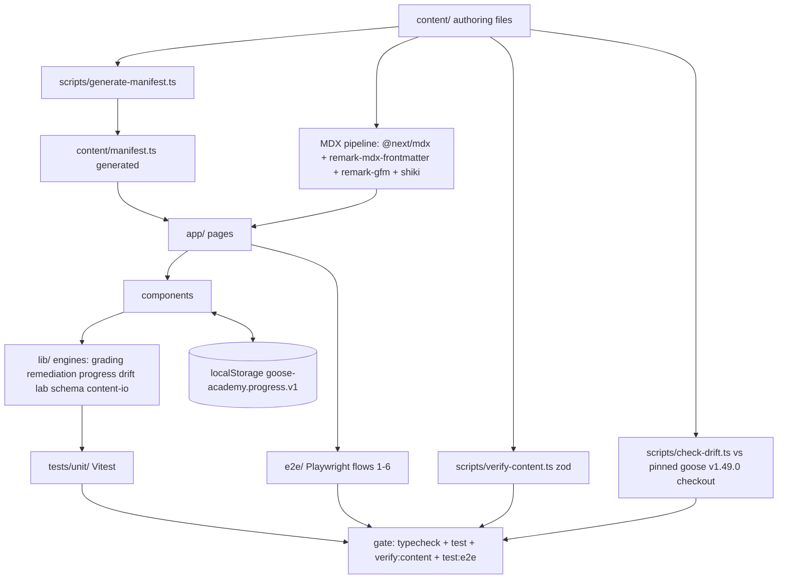

# Goose Contributor Academy — Architecture

Status: DESIGN LOCKED (see COURSE-PLAN.md §3, ground truth). This file is derived
from PROGRESS.md decisions + the Phase 1 scaffold already in this repo.

**Sources of truth:** COURSE-PLAN.md (product + app architecture), CONTENT-GUIDE.md
(content schema), PROGRESS.md (locked decisions). Siblings: usecases.md,
business-rules.md, testcases.md, milestones.md — links use exact UC/BR/TC ids.

## 1. Stack

| Layer | Choice | Notes |
|---|---|---|
| Framework | Next.js 16.3.4 (App Router, Turbopack) | `next dev`/`next build`; static by default |
| Content | MDX via `@next/mdx` | `remark-mdx-frontmatter` exports YAML frontmatter as `frontmatter` export; `remark-gfm` for tables/task lists; custom components registered in `mdx-components.tsx` (no imports needed in MDX) |
| Code highlighting | shiki v3, async in RSC | `createHighlighter` in a server component, used by `CodeRunnerPrompt` and MDX code fences |
| Styling | Tailwind v4 + `@tailwindcss/typography` | `postcss.config.mjs` via `@tailwindcss/postcss` |
| Validation | zod v4 | content schema in `lib/schema.ts`, re-used by `scripts/verify-content.ts` |
| Tests | Vitest 3 (unit) + Playwright/chromium (e2e) + tsx (scripts) | gate: `pnpm typecheck && pnpm test && pnpm verify:content && pnpm test:e2e` |
| Backend | **None (v1)** | static MDX content + LocalStorage progress + client-side grading; no SQLite/Prisma until cloud sync is a proven need |

## 2. Non-goals (v1)

- No DB, no auth, no accounts — guest learner, single browser.
- No server-side grading. Grading engines are pure TS functions in `lib/`, unit-tested.
- No on-device code execution — labs run in the learner's own PowerShell against the
  pinned goose checkout (`$env:GOOSE_REPO`), the app only records results.

## 3. Directory tree

```
goose-academy/
├─ app/
│  ├─ layout.tsx / page.tsx / globals.css
│  ├─ units/[slug]/page.tsx                  # unit overview
│  ├─ units/[slug]/[lesson]/page.tsx         # lesson page, 3 tabs
│  ├─ exam/[unit]/page.tsx
│  ├─ report/[attempt]/page.tsx
│  └─ drills/page.tsx                        # ?topic= filter
├─ components/         # Quiz, ScoreBreakdown, Remediation, ProgressRing,
│                      # Diff, CodeRunnerPrompt, FounderLens, MindShift, LabRunner
├─ lib/
│  ├─ schema.ts        # zod schemas (single source)
│  ├─ content-io.ts    # loads manifest + raw content, typed getters
│  ├─ grading.ts       # score math, topic aggregation, 100 cap, thresholds
│  ├─ remediation.ts   # weak ranking, topic->lesson map, drill selection, retake loop
│  ├─ progress.ts      # load/save/version localStorage, bestScore, completion rule
│  ├─ drift.ts         # citation checker core (file:line vs pinned checkout)
│  └─ lab.ts           # verify.ps1 generator + passMarkers verdict parsing
├─ content/
│  ├─ topics.json      # canonical topic strings (only source for `topic` values)
│  ├─ manifest.ts      # GENERATED — never hand-edit (scripts/generate-manifest.ts)
│  ├─ drills.json      # drill bank, >=16 drills
│  ├─ exams/u0.json … u3.json
│  └─ units/u{n}/l{nn}/lesson.mdx, lab.md, test.json, verify.ps1
├─ scripts/
│  ├─ generate-manifest.ts   # codegen: scans content/, writes content/manifest.ts
│  ├─ verify-content.ts      # zod-validates ALL content (pnpm verify:content)
│  └─ check-drift.ts         # cites vs pinned goose checkout (pnpm drift)
├─ tests/unit/         # grading.test.ts, remediation.test.ts, progress.test.ts,
│                      # schema.test.ts, drift.test.ts, lab.test.ts, exam.test.ts
├─ e2e/                # Playwright specs, flows 1-6
└─ documents/          # this doc set (ground truth lives here)
```

## 4. Content model (schema, zod-validated)

Per CONTENT-GUIDE.md (binding). All `topic` values must be exact strings from
`content/topics.json` (version field `1`).

| File | Restrictions | Key constraints |
|---|---|---|
| `lesson.mdx` | 8 frontmatter keys | `unit`, `unitSlug`, `order`, `id` (`u0-l01`), `slug`, `title`, `topics[]`, `durationMin`, `cites[]` |
| `cite` | real goose paths, verified per CONTENT-GUIDE "Citation verification" | `{file, line, note}`; `file` relative to goose repo root; `line` verified with `Get-Content` |
| `test.json` | array, 6-8 items | `{q, options[4], answer 0-3, topic, explanation[3]}`; explanation = one entry per WRONG option in order |
| `lab.md` | GFM, 40-50 min, PowerShell 5.1 commands | ends with `## Verification` (`powershell -File verify.ps1`) + `## Homework` |
| `verify.ps1` | PowerShell 5.1 | `param([string]$GooseRepo)`, `Check` helper printing `[PASS]/[FAIL]`, 4-7 checks, ends `VERIFY PASSED n/n` + `exit 0` / `VERIFY FAILED` + `exit 1` |
| `exams/u0..u3.json` | u0-u2 = 25 questions, u3 = 40 spanning all units | `{unitSlug, unitIndex, title, questions[], miniLab{title, instructions, verifyScript, passMarkers[]}}` |
| `drills.json` | >= 16 drills | `{id, topic, title, prompt, hint}` |
| `manifest.ts` | codegen output | typed index of units/lessons/exams; routes read this, never raw fs |

**Codegen note:** `pnpm` runs `scripts/generate-manifest.ts` to regenerate
`content/manifest.ts` whenever authoring changes content/. Hand edits are rejected
by review; the file header marks it generated.

**Lab verdict (app-side):** learner runs `verify.ps1` locally in their shell, then
in the app marks the lab verified via checkbox + optional paste of the script
output. LabRunner parses the pasted text for `VERIFY PASSED` / `VERIFY FAILED`
markers and reflects them (`lib/lab.ts`); the self-declared checkbox is the
authoritative `labVerified` flag (honor system — see BR-04, UC-05).

## 5. Data models (TS shapes, zod-backed in lib/schema.ts)

```ts
type Topic = string                          // verbatim from content/topics.json

type Cite = { file: string; line: number; note: string }

type TestItem = {
  q: string
  options: [string, string, string, string]  // exactly 4
  answer: 0 | 1 | 2 | 3
  topic: Topic
  explanation: [string, string, string]      // one per WRONG option, in order
}

type Lesson = {
  id: string            // "u0-l01"
  unitIndex: 0 | 1 | 2 | 3
  unitSlug: "rust-core" | "architecture" | "core-contribution" | "extensions"
  order: number         // l01 -> 1
  slug: string          // route segment: "01-toolchain"
  title: string
  topics: Topic[]
  durationMin: number
  cites: Cite[]
}

type Unit = {
  slug: string
  index: 0 | 1 | 2 | 3
  title: string
  lessons: string[]     // lesson ids in order
  examId: string        // "u0" .. "u3"
}

type Exam = {
  examId: string
  unitSlug: string
  unitIndex: number
  title: string
  questions: TestItem[]           // 25 (u0-u2) | 40 (u3 final)
  miniLab: {
    title: string
    instructions: string
    verifyScript: string          // PowerShell 5.1
    passMarkers: string[]         // exact strings, case-sensitive (BR-07)
  } | null
}

type Attempt = {
  ts: number
  itemIndex: number
  selected: number | null         // null = unanswered
  correct: boolean
  topic: Topic
}

type LessonProgress = {
  lessonId: string
  bestScore: number               // max over attempts, never regresses (BR-04)
  attempts: Attempt[]             // full attempt history
  labVerified: boolean            // set by learner (UC-05), consumed by BR-04
  completedAt: number | null
}

type ExamRecord = {
  examId: string
  bestScore: number
  attemptCount: number
  miniLabVerdict: {               // BR-07, set on exam submit
    passedMarkers: string[]
    missingMarkers: string[]
    verdict: "pass" | "fail"
  } | null
  completedAt: number | null
}

type Progress = {                 // localStorage shape, BR-08
  version: 1
  lessons: Record<string, LessonProgress>
  exams: Record<string, ExamRecord>
}

type Drill = { id: string; topic: Topic; title: string; prompt: string; hint: string }
```

## 6. Engines (lib/, pure TS, no React)

| Module | Pure functions | Serves |
|---|---|---|
| `grading.ts` | `scoreAttempt(items, selections)` → `{score, capped, perTopic}`; cap 100, floor 0; round to int | BR-02, BR-03 |
| `remediation.ts` | `weakTopics(perTopic)`, `mapTopicToLessons(topic)`, `pickDrills(topic, n<=3)`, `retakeLoop(steps)` | BR-06 |
| `progress.ts` | `load()`, `save(p)`, `recordAttempt()`, `isLessonComplete(lp)`, `bestScore(lp)`, `isUnitExamUnlocked()` | BR-04, BR-05, BR-08 |
| `drift.ts` | `checkCite(cite, gooseRepoRoot)` → `{file, line, ok, reason}` | BR-09 |
| `lab.ts` | `generateVerifyScript(lessonId, checks)`, `parseVerdict(pastedOutput, passMarkers)` | BR-07, UC-05 |
| `schema.ts` | zod schemas for every content model above | UC-10 |
| `content-io.ts` | typed loaders over `content/manifest.ts` + raw files | all pages |

## 7. Pages and components

### Pages

| Route | Purpose | Consumes | Key UCs/TCs |
|---|---|---|---|
| `/` | 4 unit cards, progress ring, next-up action | manifest, progress | UC-01, TC-E2E-04 |
| `/units/[slug]` | unit overview, lesson list w/ locks, exam gate | manifest, progress | UC-06, TC-E2E-03 |
| `/units/[slug]/[lesson]` | lesson page with Theory / Lab / Test tabs | lesson.mdx, lab.md, test.json, verify.ps1 | UC-02, UC-03, UC-05 |
| `/exam/[unit]` | exam mode: timed quiz + mini-lab paste field | exams/u{n}.json, lab.ts | UC-07 |
| `/report/[attempt]` | score + remediation panel + retake CTA | grading, remediation, progress | UC-03, UC-04 |
| `/drills?topic=` | drill bank filtered by topic | drills.json | UC-08 |

### Components

| Component | Purpose |
|---|---|
| `Quiz` | renders TestItems, collects selections, submits to grading |
| `ScoreBreakdown` | per-topic bars from `perTopic` aggregation |
| `Remediation` | weak topics → lessons/labs → 1-3 drills, retake CTA |
| `ProgressRing` | dashboard/lesson completion ring |
| `Diff` | oldCode/newCode side-by-side (theory) |
| `CodeRunnerPrompt` | rendered code block + `command`/`title` prompt, shiki-highlighted |
| `FounderLens` | founder lens box (Units 1-3 theory) |
| `MindShift` | FE→Rust mind-shift box (Unit 0) |
| `LabRunner` | shows lab steps, verify.ps1, checkbox + paste field w/ marker parse |

MDX components are globally registered via `mdx-components.tsx` — authoring needs no imports.

## 8. Data flow



## 9. Cross-document traceability

- Every UC (usecases.md UC-01..UC-12) → at least one TC (testcases.md) → test file → code.
- Business rules BR-01..BR-10 implement the Assessment Engine (COURSE-PLAN.md §2).
- Drift policy BR-09 uses the pinned checkout `C:\Users\admin\projects\goose`
  (v1.49.0); `GOOSE_REPO` env overrides.